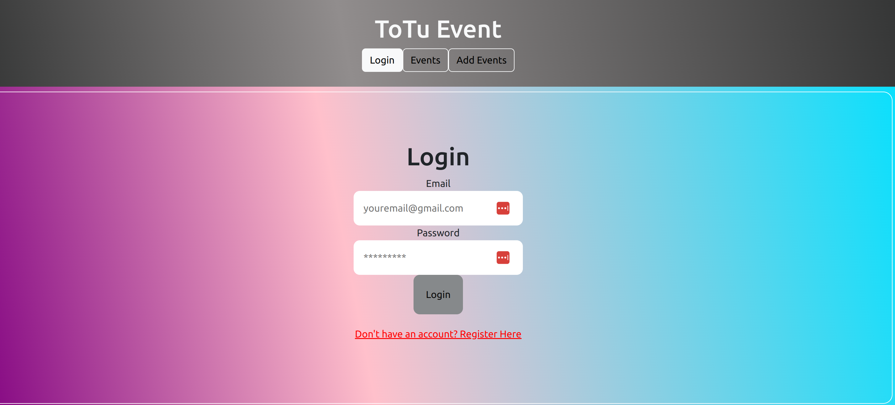
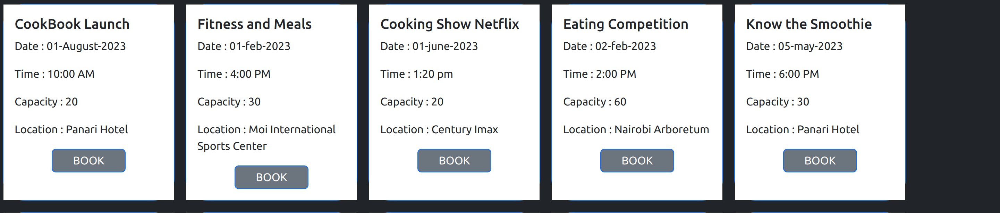
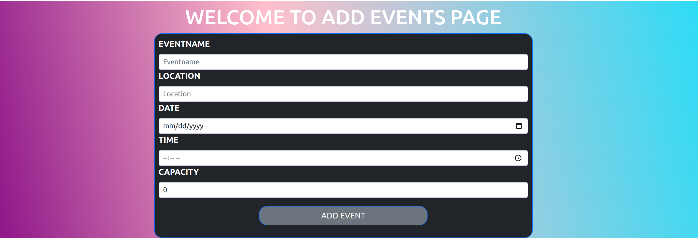

# ToTu Events

# Project Description
This project was bootstrapped with [Create React App](https://github.com/facebook/create-react-app). It is an online event booking application for several events where a user gets to log in the site and book a seat for a particular event, The user is also able to add their own event details to the application.This project is still under development.

# Project Setup

Fork and clone this Repository to your local environment and navigate to it's folder.

# Starting
Run `npm install` to install the apps dependencies.

Run `npm start` to set the app running in the browser or run by opening : [http://localhost:8001](http://localhost:8001).

Open another window in your terminal to get the backend started by running `json-server --watch db.json -p 8000`. copy this server link [http://localhost:8000](http://localhost:8000) and open in your browser to view the contents of the server.

If everything has worked correctly, you should see a page with the exact time it was loaded, along with a small amount of text and a GIF.

# Login
Upon cloning and starting the server, the user will login in order to access the several events on ToTu App.

# List of Events
A user is able to view several events listed, upcoming and past events and is able to book a seat for a particular event they have chosen to attend.

# Add Event
A user is also able to add their own event to the application for other people to see and book for the same.

# Authors

Github: [SharonTokiti](https://github.com/mshekerotokiti)

[ConsolattaChepchirchir](https://github.com/ConsolattaChepchirchir)

# License

This project is MIT Licensed

